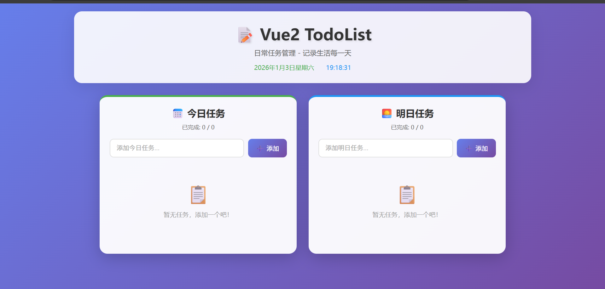
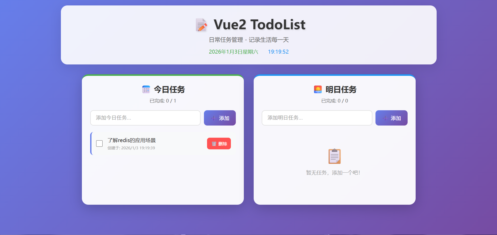
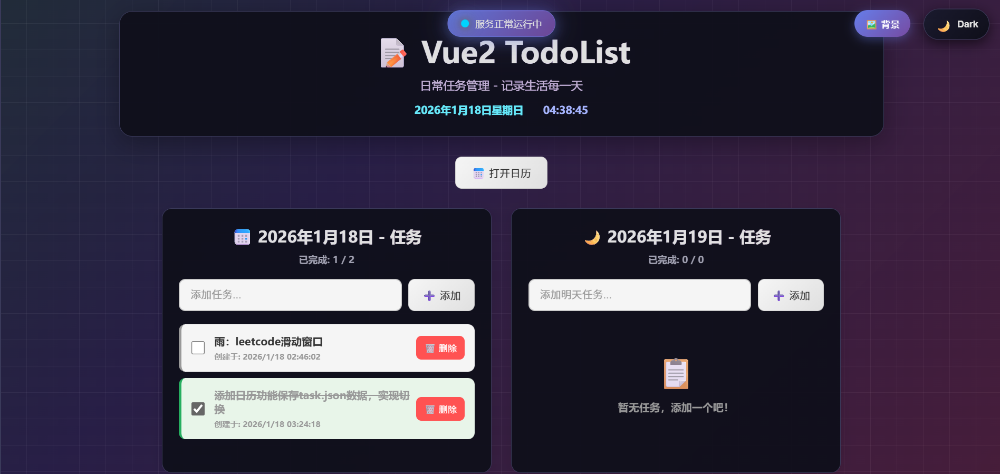

# Vue2 TodoList - 日常任务管理应用

这是一个基于 Vue2 风格（Options API）开发的日常任务管理应用，用于记录和管理今日任务与明日任务。

## 📁 项目结构

```
Vue2 TodoList/
├── index.html              # 入口 HTML 文件
├── package.json            # 项目配置文件
├── vite.config.js          # Vite 构建配置
├── server.js               # Express 后端服务器
├── tasks.json              # 任务数据存储文件
├── README.md               # 项目说明文档
├── RESUME_PROJECT.md       # 简历项目介绍
├── LOG.md                  # 开发日志
└── src/
    ├── main.js             # 应用入口文件
    ├── App.vue             # 根组件
    └── components/         # 组件目录
        ├── TodoHeader.vue  # 头部组件（标题、日期时间）
        ├── TodoInput.vue   # 输入组件（添加任务）
        ├── TodoList.vue    # 列表组件（任务列表容器）
        └── TodoItem.vue    # 单项组件（单个任务项）
```

---

## ✨ 功能特性

| 功能 | 说明 |
|------|------|
| ➕ 添加任务 | 分别添加今日任务和明日任务 |
| 🗑️ 删除任务 | 点击删除按钮移除任务 |
| ✅ 完成状态 | 勾选复选框标记任务完成 |
| 📊 统计显示 | 实时显示已完成/总任务数 |
| 💾 后端存储 | 数据自动保存到服务器 JSON 文件 |
| 🎨 响应式设计 | 适配桌面端和移动端 |

---

## 🛠️ Vue2 风格知识点总结

本项目采用 **Options API** 风格开发，涵盖以下 Vue 核心知识点：

### 1. 组件基础

```javascript
export default {
    components: { ... },  // 注册子组件
    data() {              // 响应式数据
        return { ... }
    },
    methods: { ... },     // 方法
    computed: { ... },    // 计算属性
    watch: { ... }        // 侦听器
}
```

### 2. 模板语法

| 语法 | 示例 | 说明 |
|------|------|------|
| `{{ }}` | `{{ task.title }}` | 插值表达式 |
| `v-model` | `v-model="inputValue"` | 双向数据绑定 |
| `v-for` | `v-for="task in tasks"` | 列表渲染 |
| `v-if` / `v-else` | `v-if="hasTasks"` | 条件渲染 |
| `:attr` | `:class="taskClass"` | 属性绑定 |
| `@event` | `@click="deleteTask"` | 事件绑定 |

### 3. 组件通信

**Props（父传子）**：
```javascript
// 子组件定义
props: {
    task: {
        type: Object,
        required: true
    }
}

// 父组件使用
<TodoItem :task="task" />
```

**$emit（子传父）**：
```javascript
// 子组件触发
this.$emit('delete', this.task.id)

// 父组件监听
<TodoItem @delete="handleDelete" />
```

### 4. 计算属性 computed

```javascript
computed: {
    todayCompletedCount() {
        return this.todayTasks.filter(task => task.completed).length
    }
}
```

### 5. 侦听器 watch

```javascript
watch: {
    todayTasks: {
        handler(newTasks) {
            localStorage.setItem('todayTasks', JSON.stringify(newTasks))
        },
        deep: true  // 深度监听
    }
}
```

### 6. 生命周期钩子

```javascript
mounted() {
    // 组件挂载完成后执行
    const savedTasks = localStorage.getItem('todayTasks')
    if (savedTasks) {
        this.todayTasks = JSON.parse(savedTasks)
    }
}
```

### 7. Class 绑定

```javascript
computed: {
    taskClass() {
        return {
            'task-item': true,
            'completed': this.task.completed
        }
    }
}
```

```html
<li :class="taskClass">...</li>
```

### 8. 事件修饰符

```html
<!-- 回车键触发 -->
<input @keyup.enter="submitTask">

<!-- 阻止默认行为 -->
<form @submit.prevent="handleSubmit">
```

### 9. 过渡动画

```html
<transition-group name="list" tag="ul">
    <TodoItem v-for="task in tasks" :key="task.id" />
</transition-group>
```

```css
.list-enter-active,
.list-leave-active {
    transition: all 0.3s ease;
}
.list-enter-from { opacity: 0; transform: translateX(-30px); }
.list-leave-to { opacity: 0; transform: translateX(30px); }
```

---

## 📸 效果展示

### 界面预览







---

## 🚀 快速开始

### 安装依赖

```bash
npm install
```

### 启动后端服务器（必需）

```bash
node server.js
```
服务器运行在 http://localhost:4096

### 启动开发服务器

```bash
npm run dev
```

### 构建生产版本

```bash
npm run build
```

### 预览生产版本

```bash
npm run preview
```

### 前后端都需要启动才能正常使用

---

## 📚 组件说明

### App.vue - 根组件

- **职责**：管理全局状态，协调子组件
- **数据**：`todayTasks`、`tomorrowTasks`、`taskIdCounter`
- **方法**：添加/删除/切换任务状态
- **特性**：通过 REST API 与后端通信实现数据持久化

### TodoHeader.vue - 头部组件

- **职责**：显示应用标题和当前日期时间
- **特性**：使用 `setInterval` 实现时间实时更新

### TodoInput.vue - 输入组件

- **职责**：接收用户输入，触发添加任务事件
- **Props**：`placeholder` - 输入框占位文本
- **事件**：`add-task` - 向父组件发送新任务

### TodoList.vue - 列表组件

- **职责**：渲染任务列表，处理空状态
- **Props**：`tasks` - 任务数组
- **事件**：`delete-task`、`toggle-task`
- **特性**：使用 `transition-group` 实现列表动画

### TodoItem.vue - 单项组件

- **职责**：显示单个任务，处理完成和删除操作
- **Props**：`task` - 单个任务对象
- **事件**：`delete`、`toggle`
- **特性**：使用计算属性动态绑定样式类

---

## 🎯 学习要点

1. **组件化开发**：将 UI 拆分为独立、可复用的组件
2. **单向数据流**：数据从父组件流向子组件（Props）
3. **事件向上传递**：子组件通过 `$emit` 通知父组件
4. **响应式原理**：`data()` 返回的对象会被 Vue 转换为响应式
5. **计算属性缓存**：`computed` 基于依赖缓存，性能优于 `methods`
6. **深度监听**：`watch` 配合 `deep: true` 监听对象/数组内部变化

---

## 📝 License

MIT License - 仅供学习使用